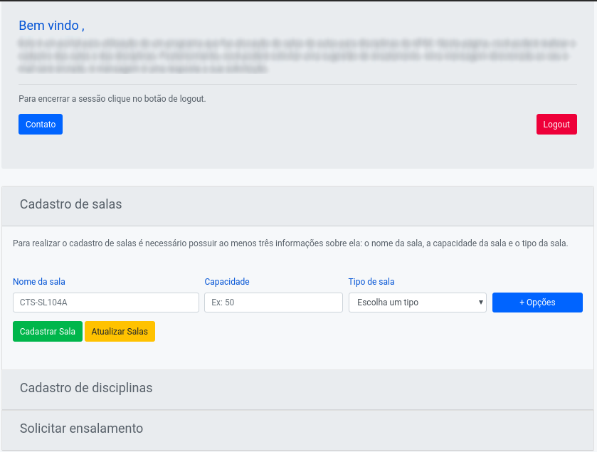
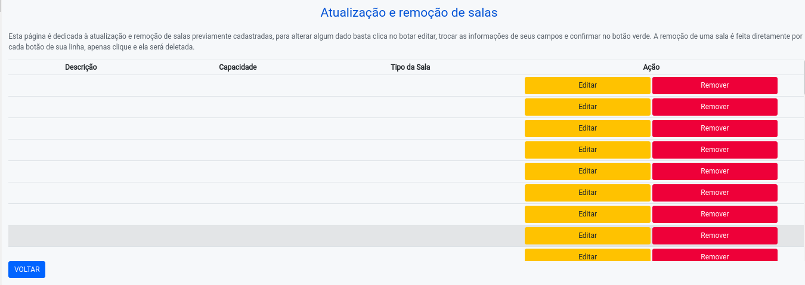
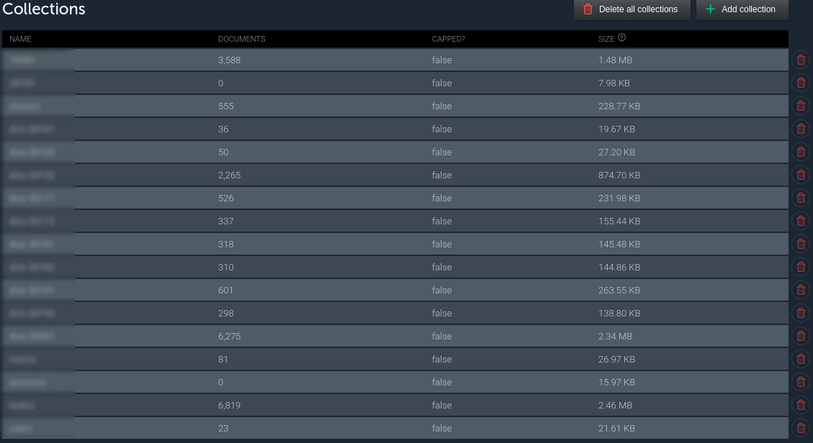

# Interface for managing room allocation

## Objective
This repository was an effort for creating one application capable of handle all information about rooms and class schedules, so with an external code it could be capable of generate the best allocation pair of room and class based on linear programming algorithms.

### Main page - insertions

### Update page
This is an example of the room att page, there is an option not shown in other page for updating other info. It's not currently connected to DB (see DB section) so it's blank.

### Database
MLab was used in this project for the easy setup, after inserting around 2 years of data the database looked like the image below

## Technology

* [NodeJS](https://nodejs.org/en/) as a backend.
* [MongoDB](https://www.mongodb.com/) as database aiming for an flexible storage.
* [Handlebars](https://handlebarsjs.com/) for providing the template engine.
* [MLab](https://mlab.com/) DbaaS

